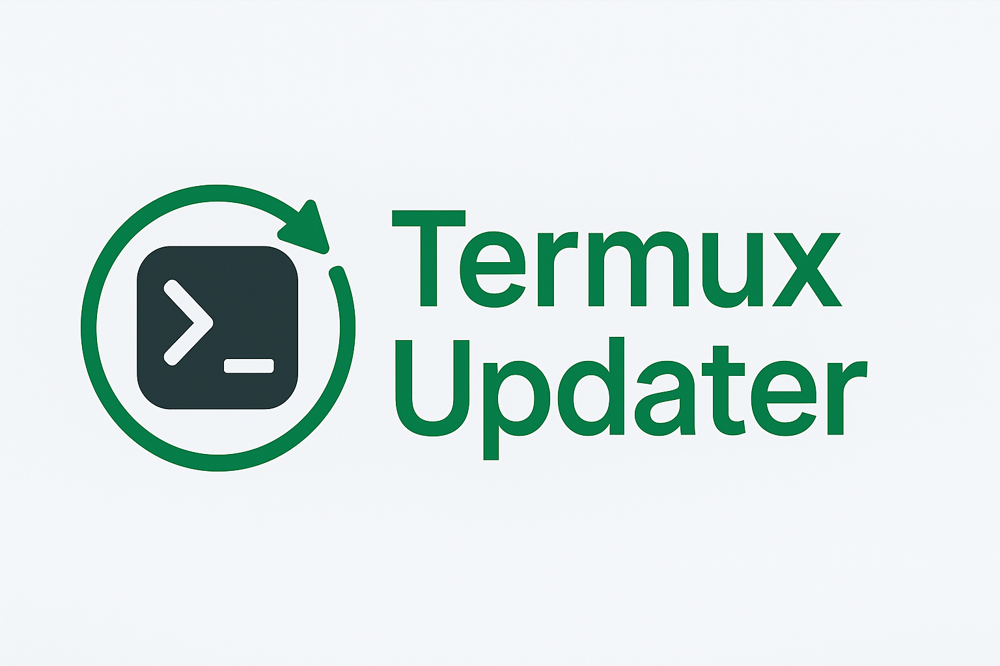
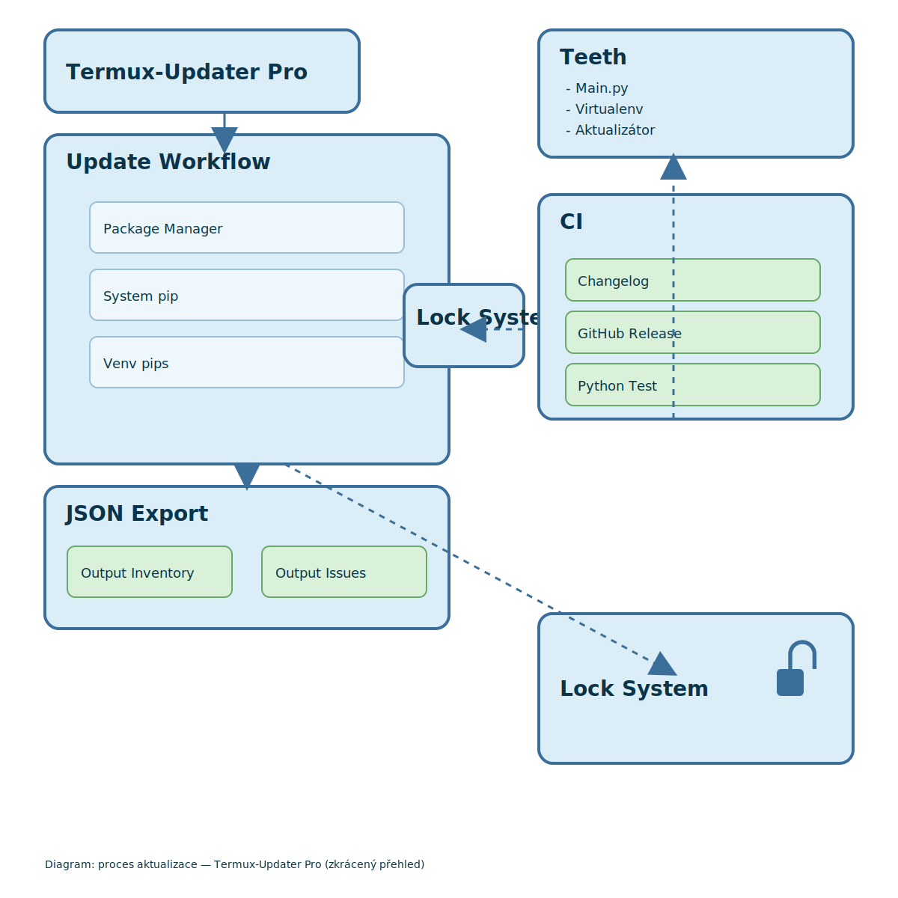

<p align="center">
  
</p>

<p align="center">
  <a href="https://github.com/Ravarentoren/Termux-Updater/releases"></a>
  <a href="https://github.com/Ravarentoren/Termux-Updater/stargazers"></a>
  <a href="LICENSE"></a>
  <a href="docs/README_EN.md"></a>
  <a href="docs/README_CZ.md"></a>
</p>

---

# Termux-Updater Pro

**Termux-Updater Pro** is an advanced, fully automated update and maintenance system  
for the Termux environment.

It updates **pkg**, **system pip**, and **multiple virtual environments (venv)** simultaneously,  
handles conflicts intelligently, generates structured JSON reports,  
and ensures long-term stability for professional and long-term development workflows.

---

## 🚀 Key Features

- Automatic update of:
  - Termux **pkg** packages  
  - Termux **system pip** packages  
  - All pip packages inside **any number of virtual environments**
- Independent update pipelines for pkg / pip / venvs
- Intelligent conflict detection and resolution
- Process lock protection (no parallel runs)
- JSON reports:
  - `Aktualizator_seznam.json` — clean inventory of updated packages  
  - `Aktualizator_issue.json` — warnings, conflicts, errors
- Fully autonomous daily operation
- Designed for long-term project survival and reproducibility

---

@@ ##  Struktura projektu
+
+### Diagram architektury
+
+<p align="center">
+  
+</p>

---

## ⭐ Installation

### 1. Clone the repository

```bash
git clone https://github.com/Ravarentoren/Termux-Updater.git
cd Termux-Updater

2. Make the updater executable

chmod +x aktualizator/Termux-Updater-Pro.py

3. Create a global Termux command

ln -sf $(pwd)/aktualizator/Termux-Updater-Pro.py ~/bin/aktualizator


---

🛠 Usage

Basic run

aktualizator

Run with custom configuration

aktualizator --mode C --verbose --venv-dir ~/venv

Dry-run test (no changes applied)

aktualizator --dry-run --verbose


---

🧠 Update Modes Overview

Mode	Description

A	Termux pkg only
B	pkg + system pip
C	pkg + system pip + all venv pip environments
D	Full autonomous mode (daily use) — recommended


---

📄 JSON Output Files

File	Description

Aktualizator_seznam.json	Clean list of updated items
Aktualizator_issue.json	All warnings, conflicts, errors


Both files are always stored in:

~/storage/downloads/


---

📘 Documentation

Czech documentation: docs/README_CZ.md

English documentation: docs/README_EN.md


---

📝 License

This project is dual-licensed under:

MIT License

Apache License 2.0


You may freely choose either license according to your needs.


---

🤝 Contributing

Contributions, ideas, improvements, tests, and bug reports are welcome.
The project is designed to be open, transparent, and community-friendly.


---

❤️ Credits

Termux-Updater Pro is a collaboration between
Ravarentoren and ChatGPT (OpenAI),
built to create the world’s most reliable Termux automation and update system.

